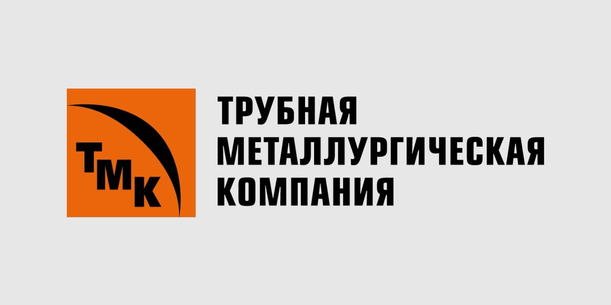
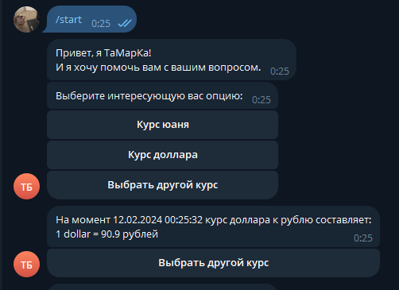
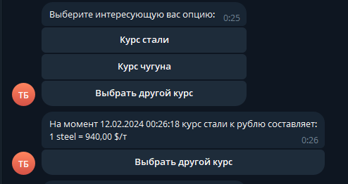
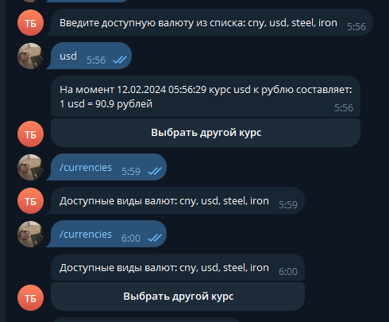

<p align="center">

 <br/>
<H2 align="center">Кейс команды №7 INFinity</H2>
</p>

> Команда INFinity представляет телеграмм бота для получения текущих данных курса валют и металлов. 

## Функциональность

### Получение курса валюты


### Получение курса металлов


### Список доступных валют


```Решение позволяет:```
- _Получать в один клик актуальную цену валюты или металла_
- _Вводить вручную требуемую валюту или металл_
- _Пользоваться системой даже при проблемах на стороне телеграмма_
- _Получать актуальные данные с серверов московской биржи и сайта investing.com_
- _Внедрить решение в один клик при помощи docker контейнеров_

## Установка и запуск

### telegram bot
Для установки всех зависимостей для запуска telegram бота требуется выполнить:

Для установки всех зависимостей проекта требуется выполнить:
```sh
pip install -r requirements.txt
```

Запуск производится запуском файла `main.py`

Для запуска бота в docker контейнере требуется выполнить следующую команду:
```sh
docker-compose up
```

### API
Для установки всех зависимостей проекта в папке api требуется выполнить:
```sh
pip install -r requirements.txt
```

Запуск производится запуском файла `main.py`

Для запуска api в docker контейнере требуется выполнить следующую команду в папке с api:
```sh
docker-compose up
```

Все права защищены. &copy; INFinity.
